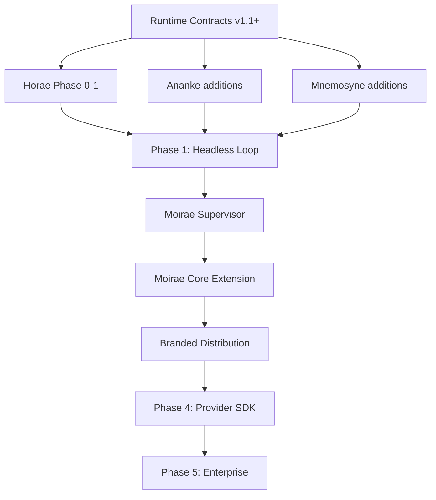

# Moirae Code — Roadmap & Build Plan

> **Status — July 2026:** Moirae monorepo scaffold complete and building (16 packages). **BLOCKED** waiting on completion of the Fate runtimes (Ananke, Mnemosyne, Horae) and Runtime Contracts extensions in their independent repositories. See [Blockers & Critical Path](#blockers--critical-path) below.

---

## Current State: What's Done vs What's Blocked

### Moirae Monorepo (This Repo) — DONE

| Package | State | Description |
|---------|-------|-------------|
| `@moirae/runtime-contracts` | ✅ Built | Shared types: identity, runtime, results, audit, protocol |
| `@moirae/local-ipc` | ✅ Built | JSON-RPC 2.0 transport types |
| `@moirae/provider-sdk` | ✅ Built | ModelProvider interface + streaming events |
| `@moirae/tool-sdk` | ✅ Built | ToolManifest, RiskClass, SideEffectClass, ToolEvidence |
| `@moirae/policy-profiles` | ✅ Built | Standard + Strict profiles with risk defaults |
| `@moirae/secret-broker` | ✅ Built | OS keychain abstraction + in-memory impl |
| `@moirae/network-broker` | ✅ Built | 5-level outbound connection policy |
| `@moirae/supervisor` | ✅ Built | Process lifecycle scaffold |
| `@moirae/ui-components` | 🔶 Placeholder | React components — Phase 2 |
| `@moirae/update-service` | 🔶 Placeholder | Auto-updater — Phase 3 |
| `@moirae/core-extension` | ✅ Built | VS Code extension scaffold (4 sidebar views) |
| `@moirae/diagnostics-cli` | ✅ Built | Working CLI (check, status, env) |
| `@moirae/ananke-client` | ✅ Built | Typed HTTP client for Ananke Gateway |
| `@moirae/mnemosyne-client` | ✅ Built | Typed MCP client for Almanac tools |
| `@moirae/horae-client` | ✅ Built | Typed HTTP client for Horae sessions |
| `@moirae/provider-openai-compatible` | ✅ Built | Full adapter (Ollama, llama.cpp, LM Studio, vLLM, etc.) |
| `@moirae/git-adapter` | 🔶 Placeholder | Git operations — Phase 1 |

### External Dependencies — BLOCKED

| Repository | What We Need | Current State | Blocker Impact |
|------------|-------------|---------------|----------------|
| **Project-Ananke** | Production auth, Agent SDK, real MCP validation, content-sensitive reads, information-flow control | ✅ Phase 1 prototype (60 tests, 7 scenarios) ❌ Not production-hardened | Cannot integrate governed execution into headless loop |
| **Project-Mnemosyne** | Complete MCP server (Almanac tools), Ananke safety bridge, validation reports, combined demo | 🔄 MCP + Ananke adapter in progress (milestones 8-9) | Cannot retrieve governed context packs or route safety signals |
| **Project-Horae** | Runtime registry, capability planner, session orchestrator, profile loader, bindings to Ananke + Mnemosyne | ❌ Design docs only, zero implementation | No composition layer exists — this is the single biggest blocker |
| **project-runtime-contracts** | Workflow types, model descriptor types, context pack types, tool proposal types, approval types, evidence types, cancellation types | ✅ v1.1.0 base contracts ❌ Missing workflow/memory/approval types | Shared types incomplete for cross-runtime orchestration |

---

## Table of Contents

1. [Ecosystem Status Summary](#ecosystem-status-summary)
2. [Phase Roadmap](#phase-roadmap)
3. [Blockers & Critical Path](#blockers--critical-path)
4. [Third-Party Dependencies](#third-party-dependencies)
5. [Testing Strategy](#testing-strategy)
6. [Risk Register](#risk-register)

---

## Ecosystem Status Summary

### Current State of Component Runtimes

| Runtime | Current Version | Protocol Version | Tests | Maturity |
|---------|----------------|-----------------|-------|----------|
| **Ananke** | v0.1.0 (Phase 1 prototype) | v1.0.0 | 60 tests, 7 must-pass scenarios | Solid prototype, not production-hardened |
| **Mnemosyne** | v0.1.0 (MVP) | v1.0.0 | Unit tests across 8 packages | MVP implemented, MCP + Ananke adapters in progress |
| **Horae** | Pre-implementation | Planned v1.1.0 | None yet | Design docs + scaffold only |
| **Runtime Contracts** | v1.1.0 | v1.1.0 (min v1.0.0) | Sample import + protocol negotiation | Stable contracts, Horae-ready |

### What Each Runtime Currently Delivers

**Ananke (ready for integration):**
- Typed outcome envelopes with 7 states and 13 reason codes
- SHA-256 hash-bound approval binding over canonical JSON
- Deterministic risk-class-based policy engine (READ_ONLY, INTERNAL_WRITE, EXTERNAL_SEND, DELETE, PAYMENT, DEPLOYMENT, PERMISSION_CHANGE, UNKNOWN)
- SQLite + in-memory audit logging with pluggable `IAuditLog`
- MCP stdio client adapter (filesystem demo working)
- HTTP API on port 3000 with approval dashboard
- Policy file auto-discovery (ananke.policy.yaml/yml/json)
- Validation report export (JSON + CSV)
- 7 must-pass test scenarios: safe read allowed, policy denied, external send requires approval, approval hash match/mismatch, timeout typed outcome, prompt injection flagged

**Mnemosyne (ready for integration):**
- Almanac store (in-memory + SQLite-backed) with full CRUD
- Workspace guard (canonical path checks, symlink escape, traversal denial, delete policy)
- Onboarding engine (project scan, source hashing, source typing, candidate memory extraction)
- Reliability engine (source-type weights, hash validity, confirmations, contradictions, supersession)
- Retrieval engine (task-aware context-pack ranking, conflict propagation, token budgeting)
- Conflict engine (hash change detection, missing source, user-vs-law, supersession, recommendations)
- Decay engine (slow and fast decay, stale status transitions, revalidation recovery)
- Session engine (start revalidation, context pack creation, end summary, journal/audit updates)
- MCP adapter (9 Almanac tools: status, search, context_pack, read_memory, request_source, write_memory, append_journal, report_conflict, revalidate)
- Ananke adapter (safety bridge: CONFLICT_DETECTED, LOW_RELIABILITY_CONTEXT, SOURCE_MISSING, ACTION_CONTEXT_INSUFFICIENT)
- CLI scaffold (init, status)

**Horae (design phase):**
- Role and authority boundaries fully documented
- 12 Laws of Horae defined
- Architecture and runtime integration docs complete
- Implementation plan defined across 5 phases
- Package scaffold: schema, runtime-registry, capability-planner, session-orchestrator, profile-loader, ananke-binding, mnemosyne-binding, gateway-adapter, audit-router, runtime-core, testbench

**Runtime Contracts (ready for all consumers):**
- Runtime identity (name, version, protocol version, capabilities, metadata)
- Project identity (id, name, rootPath)
- Capability manifests (16 categories, 3 exposure levels)
- Runtime health (6 states: healthy, busy, read_only, updating, unavailable, degraded)
- Runtime registration (identity, endpoints, transport, health)
- Runtime profiles (7 modes: autonomous, ci, personal_development, production, read_only, strict_enterprise, testing)
- Runtime sessions (project, agent, task, profile, runtime bindings)
- Runtime compositions (bindings with roles: approval, audit, execution_governor, gateway, memory, orchestrator, policy, tool_source)
- Runtime events (14 event types)
- Well-known runtime names: ananke, mnemosyne, horae, moira

---

## Phase Roadmap

### Phase 0 — Foundation (Current)

**Goal:** All component runtimes reach minimum viable integration readiness.

| # | Task | Owner | Status | Blocks |
|---|------|-------|--------|--------|
| 0.1 | Ananke: production auth/RBAC for dashboard | Ananke | ❌ Not started | — |
| 0.2 | Ananke: real MCP server validation beyond demo | Ananke | ❌ Not started | — |
| 0.3 | Ananke: Agent SDK for Claude/GPT/Gemini | Ananke | ❌ Not started | Phase 1 |
| 0.4 | Ananke: content-sensitive read governance design | Ananke | ❌ Not started | Phase 2 |
| 0.5 | Mnemosyne: complete MCP server implementation | Mnemosyne | 🔄 In progress | Phase 1 |
| 0.6 | Mnemosyne: complete Ananke adapter implementation | Mnemosyne | 🔄 In progress | Phase 1 |
| 0.7 | Mnemosyne: validation report export (JSON/CSV) | Mnemosyne | ❌ Not started | — |
| 0.8 | Mnemosyne: demo command (init→onboard→store→recall→context→conflict→score→decay→audit) | Mnemosyne | ❌ Not started | — |
| 0.9 | Horae: Phase 0 — Contracts and Admission | Horae | ❌ Not started | Phase 1 |
| 0.10 | Horae: Phase 1 — Secure Registry and Least-Capability Planner | Horae | ❌ Not started | Phase 1 |
| 0.11 | Runtime Contracts: extend with workflow/model/context/tool proposal/approval/memory/audit/evidence/cancellation types | Runtime Contracts | ❌ Not started | All phases |

### Phase 1 — Headless Governed Coding Loop

**Goal:** Prove the full governed loop works through a CLI before building any IDE.

**Success criterion:** A CLI can accept a coding request, build Mnemosyne context, have a model propose actions through Horae, have Ananke evaluate every action, execute through a local tool runner, and produce typed outcomes + audit — all repeatable and validated.

| # | Task | Depends On | Priority | Estimated Effort |
|---|------|-----------|----------|-----------------|
| 1.1 | Horae runtime registry: discover, authenticate, verify protocol compatibility of Ananke + Mnemosyne | 0.9, 0.10 | 🔴 Critical | 2-3 weeks |
| 1.2 | Horae capability planner: deterministic least-capability task plans | 0.10 | 🔴 Critical | 2-3 weeks |
| 1.3 | Horae session orchestrator: start correlated session with shared identifiers | 1.1, 1.2 | 🔴 Critical | 2-3 weeks |
| 1.4 | Horae ananke-binding: identity, health, policy, approval, execution routes | 0.3, 1.1 | 🔴 Critical | 1-2 weeks |
| 1.5 | Horae mnemosyne-binding: identity, health, context packs, reliability/conflict signals | 0.5, 1.1 | 🔴 Critical | 1-2 weeks |
| 1.6 | Implement end-to-end governed vertical slice (see Horae Phase 2) | 1.1-1.5 | 🔴 Critical | 3-4 weeks |
| 1.7 | Horae testbench: incompatible protocols, forged identity, duplicate capabilities, stale events, replayed approvals, runtime restarts, lost safety signals | 1.6 | 🔴 Critical | 2-3 weeks |
| 1.8 | CLI inspection, planning, session, and validation-report commands | 1.6 | 🟡 High | 1-2 weeks |
| 1.9 | Export combined JSON/CSV validation reports | 1.6, 1.7 | 🟡 High | 1 week |

### Phase 2 — Moirae Core Extension

**Goal:** Build the first-party VS Code extension that connects the governed loop to the IDE, running initially in ordinary VSCodium.

| # | Task | Depends On | Priority | Estimated Effort |
|---|------|-----------|----------|-----------------|
| 2.1 | Moirae Supervisor: process startup, service discovery, health, migrations, crash recovery, local session credentials, component version compatibility | Phase 1 | 🔴 Critical | 3-4 weeks |
| 2.2 | Local IPC: authenticated JSON-RPC/MCP communication between extension and supervisor | 2.1 | 🔴 Critical | 2-3 weeks |
| 2.3 | Chat surface: custom webview with model selector, policy status, memory scope, network state | 2.2 | 🔴 Critical | 3-4 weeks |
| 2.4 | Approval UX: code-review quality diff review with resource/side-effect/validation display | 2.2, 1.4 | 🔴 Critical | 3-4 weeks |
| 2.5 | Memory explorer: Mnemosyne sidebar view (active memories, proposals, contradictions, source refs, accept/edit/reject/forget) | 2.2, 1.5 | 🔴 Critical | 2-3 weeks |
| 2.6 | Authority view: Ananke sidebar (pending approvals, policy profile, denied operations, session authority, revocation) | 2.2, 1.4 | 🟡 High | 2-3 weeks |
| 2.7 | Runtime health view: component status, connected models, MCP servers, local/network state, DB health | 2.2, 1.3 | 🟡 High | 1-2 weeks |
| 2.8 | Audit timeline view: chronological event stream per workspace | 2.2, 1.4 | 🟡 High | 1-2 weeks |
| 2.9 | Model/provider configuration UI | 2.2 | 🟡 High | 1-2 weeks |
| 2.10 | Diagnostics CLI: health checks, log collection, environment validation | 2.1 | 🟡 High | 1-2 weeks |
| 2.11 | Secret broker: OS keychain integration (Windows Credential Manager, macOS Keychain, Linux libsecret) | 2.1 | 🟡 High | 1-2 weeks |
| 2.12 | Network broker: outbound connection policy (blocked/loopback/provider-only/approved/unrestricted) | 2.1 | 🟡 High | 1-2 weeks |

### Phase 3 — Branded VSCodium Distribution

**Goal:** Ship a complete, installable Moirae Code IDE with safe defaults.

| # | Task | Depends On | Priority | Estimated Effort |
|---|------|-----------|----------|-----------------|
| 3.1 | VSCodium thin fork: branding, icons, about dialog, default settings | — | 🔴 Critical | 2-3 weeks |
| 3.2 | Bundle integration: supervisor auto-start, extension pre-installed | 2.1, 3.1 | 🔴 Critical | 2-3 weeks |
| 3.3 | Safe default policies: workspace-scoped, local-first, approval-required for writes | 1.4 | 🔴 Critical | 1-2 weeks |
| 3.4 | Curated extension set: selected Open VSX extensions pre-vetted | — | 🟡 High | 1-2 weeks |
| 3.5 | Windows installer (MSI/EXE) with code signing | 3.1, 3.2 | 🟡 High | 2-3 weeks |
| 3.6 | Linux installer (AppImage/deb) | 3.1, 3.2 | 🟢 Medium | 1-2 weeks |
| 3.7 | macOS installer (DMG) with notarization | 3.1, 3.2 | 🟢 Medium | 1-2 weeks |
| 3.8 | Auto-update service: signed update manifests, release channels, rollback | 3.2 | 🟢 Medium | 2-3 weeks |
| 3.9 | Supply chain: SBOM, dependency scanning, secret scanning, license scanning, provenance attestations | 3.1 | 🟡 High | Ongoing |
| 3.10 | First-run experience: onboarding wizard, model setup, policy profile selection | 2.3-2.9 | 🟡 High | 2-3 weeks |

### Phase 4 — Provider and MCP Ecosystem

**Goal:** Publish SDKs and adapters so third parties can add models, tools, and MCP servers.

| # | Task | Depends On | Priority | Estimated Effort |
|---|------|-----------|----------|-----------------|
| 4.1 | Provider SDK: `ModelProvider` interface, streaming events, token counting, capability declarations, auth hooks, error normalization | Phase 2 | 🔴 Critical | 3-4 weeks |
| 4.2 | Tool SDK: tool manifests, side-effect declarations, input/output schemas, evidence objects, compensation metadata, execution constraints | Phase 2 | 🔴 Critical | 2-3 weeks |
| 4.3 | Ollama-compatible adapter | 4.1 | 🟡 High | 1 week |
| 4.4 | llama.cpp server adapter | 4.1 | 🟡 High | 1 week |
| 4.5 | LM Studio-compatible adapter | 4.1 | 🟢 Medium | 1 week |
| 4.6 | Generic OpenAI-compatible adapter | 4.1 | 🔴 Critical | 1-2 weeks |
| 4.7 | Anthropic adapter | 4.1 | 🟡 High | 1 week |
| 4.8 | Google/Gemini adapter | 4.1 | 🟢 Medium | 1 week |
| 4.9 | DeepSeek adapter | 4.1 | 🟢 Medium | 1 week |
| 4.10 | Mistral adapter | 4.1 | 🟢 Medium | 1 week |
| 4.11 | Manifest validator tool | 4.2 | 🟡 High | 1-2 weeks |
| 4.12 | Extension API/SDK for third-party extensions | Phase 2 | 🟢 Medium | 3-4 weeks |
| 4.13 | Self-hosted Open VSX registry (curated Moirae extensions) | — | 🟢 Medium | 4-6 weeks |
| 4.14 | Compatibility test harness for providers and tools | 4.1, 4.2 | 🟡 High | 2-3 weeks |

### Phase 5 — Team & Enterprise Edition

**Goal:** Enable managed team deployments with centralized governance.

| # | Task | Depends On | Priority | Estimated Effort |
|---|------|-----------|----------|-----------------|
| 5.1 | Organisation identity: OIDC + SAML via identity broker | — | 🟢 Medium | 4-6 weeks |
| 5.2 | Signed enterprise policy bundles (admin-distributed) | Phase 3 | 🟢 Medium | 2-3 weeks |
| 5.3 | Shared team Almanac (approved memory, team decisions, policies) | Phase 3 | 🟢 Medium | 3-4 weeks |
| 5.4 | Team audit export and compliance reporting | Phase 3 | 🟢 Medium | 2-3 weeks |
| 5.5 | Managed model gateway (enterprise provider routing) | Phase 4 | 🟢 Medium | 3-4 weeks |
| 5.6 | Enterprise MCP identity and authorization | — | 🟢 Medium | 3-4 weeks |
| 5.7 | Central extension governance (allow/deny, version pinning) | Phase 4 | 🟢 Medium | 2-3 weeks |
| 5.8 | Encrypted settings synchronization (optional Moirae account) | Phase 3 | 🟢 Medium | 2-3 weeks |

---

## Blockers & Critical Path

### Current Blockers (Updated July 2026)

| ID | Blocker | Impact | Affected Phases | Mitigation / Status |
|----|---------|--------|-----------------|---------------------|
| B-01 | **Horae not yet implemented** | Cannot start Phase 1 headless loop | 1, 2, 3, 4, 5 | ❌ External repo — [Project-Horae](https://github.com/hourwise/Project-Horae) has design docs only. This is the single biggest blocker. |
| B-02 | **Mnemosyne MCP server incomplete** | Cannot expose governed memory to Horae/IDE | 1, 2 | 🔄 In progress — [Project-Mnemosyne](https://github.com/hourwise/Project-Mnemosyne) Milestone 8 of 9. |
| B-03 | **Mnemosyne Ananke adapter incomplete** | Cannot route safety signals between memory and authority | 1, 2 | 🔄 In progress — [Project-Mnemosyne](https://github.com/hourwise/Project-Mnemosyne) Milestone 9 of 9. |
| B-04 | **Ananke needs production hardening** | Dashboard/API auth insufficient for real use; Agent SDK missing | 1, 2, 3 | ❌ External repo — [Project-Ananke](https://github.com/hourwise/Project-Ananke) roadmap: production auth, real MCP validation, Agent SDK. |
| B-05 | **Runtime Contracts missing workflow/memory/approval types** | Horae cannot describe governed task compositions | 0, 1 | ❌ External repo — [project-runtime-contracts](https://github.com/hourwise/project-runtime-contracts) needs workflow, model, context, tool proposal, approval, memory, audit, evidence, cancellation types. |

### Resolved Blockers (Moirae Monorepo)

| ID | Former Blocker | Resolution |
|----|---------------|------------|
| ~~B-02~~ | No Provider SDK | ✅ `@moirae/provider-sdk` built with full ModelProvider interface + streaming events |
| ~~B-06~~ | No shared IPC protocol | ✅ `@moirae/local-ipc` built with JSON-RPC 2.0 message types + transport interface |
| ~~Provider adapters~~ | No model adapters | ✅ `@moirae/provider-openai-compatible` fully functional (universal fallback for Ollama, llama.cpp, LM Studio, vLLM) |
| ~~Tool SDK~~ | No tool manifest types | ✅ `@moirae/tool-sdk` built with Zod-validated manifests, 8 risk classes, 8 side-effect classes |
| ~~Policy profiles~~ | No default policy configs | ✅ `@moirae/policy-profiles` built with Standard + Strict profiles |
| ~~Secret handling~~ | No credential abstraction | ✅ `@moirae/secret-broker` built |
| ~~Network control~~ | No outbound policy | ✅ `@moirae/network-broker` built |
| ~~Supervisor~~ | No process lifecycle | ✅ `@moirae/supervisor` scaffolded |

### Next Tasks Once Unblocked (Priority Order)

When the external repos reach minimum viable state, the immediate work is:

| # | Task | Package | Depends On |
|---|------|---------|------------|
| 1 | Implement Horae Runtime Registry | New: `packages/horae-runtime/` | B-01, B-05 |
| 2 | Implement Horae Capability Planner | New: `packages/horae-runtime/` | Task 1 |
| 3 | Implement Horae Session Orchestrator | New: `packages/horae-runtime/` | Tasks 1-2, B-02, B-03 |
| 4 | Wire Supervisor to spawn & manage Fate processes | `packages/supervisor/` | Tasks 1-3, B-01, B-04 |
| 5 | End-to-end governed vertical slice (CLI demo) | `apps/diagnostics-cli/` | Tasks 1-4 |
| 6 | Export combined JSON/CSV validation reports | `scripts/` | Task 5 |

### What Can Be Done Now (Unblocked Work)

While waiting on the external repos, the Moirae monorepo can advance on:

- **`@moirae/runtime-contracts`** — add Moirae-specific types not covered by external Runtime Contracts (supervisor configs, packaging metadata, update manifest types)
- **`@moirae/provider-sdk`** — add Anthropic, Google, DeepSeek provider adapters following the same pattern as OpenAI-compatible
- **`@moirae/tool-sdk`** — implement manifest validator, evidence object validation
- **`tests/contract/`** — write contract tests for all package interfaces
- **`tests/adversarial/`** — write malicious scenario tests (prompt injection, path traversal, tool poisoning)
- **`@moirae/ui-components`** — design approval card, diff review, memory card, audit timeline React components
- **`@moirae/supervisor`** — implement health check polling, crash recovery, migration logic (currently stubs)
- **Docs** — threat model, extension policy guide, provider integration guide

### Critical Path (Minimum Viable Moirae Code)

```
Runtime Contracts extension (B-07)
    ↓
Horae Phase 0: Contracts and Admission (B-01)
    ↓
Horae Phase 1: Registry + Capability Planner (B-01)
    ↓
Mnemosyne MCP + Ananke adapter complete (B-03, B-04)
    ↓
Horae Phase 2: Governed Vertical Slice (B-01)
    ↓
Phase 1: Headless Governed Coding Loop ← FIRST MILESTONE
    ↓
Moirae Supervisor + Local IPC (B-06)
    ↓
Moirae Core Extension ← SECOND MILESTONE
    ↓
Branded VSCodium Distribution ← THIRD MILESTONE
```

### Dependency Graph



---

## Third-Party Dependencies

### Build & Runtime Foundations

| Dependency | Version | License | Usage | Risk Level |
|------------|---------|---------|-------|------------|
| **VSCodium / Code-OSS** | Latest stable | MIT | Editor foundation, extension host, terminal, Git UI, debugger | 🟢 Low — thin fork, minimal patches |
| **Electron** | Inherited from VSCodium | MIT | Cross-platform desktop shell | 🟢 Low — inherited, must verify security settings |
| **Node.js** | 22+ LTS | MIT | Local control plane, supervisor, all Fates | 🟢 Low |
| **TypeScript** | 5.x | Apache 2.0 | All first-party packages | 🟢 Low |
| **SQLite** (better-sqlite3 or native) | 3.x | Public Domain | Persistent state for Ananke audit, Mnemosyne Almanac, Horae registry | 🟢 Low — WAL mode required |

### Extension Ecosystem

| Dependency | License | Usage | Risk Level |
|------------|---------|-------|------------|
| **Open VSX** | Eclipse Public License 2.0 | Extension marketplace (instead of Microsoft Marketplace) | 🟢 Low — can self-host curated registry |
| **VS Code Extension API** | MIT | Extension development (views, webviews, chat, secrets, terminal) | 🟢 Low — official API |

### Model Provider APIs (to be adapted)

| Provider | Locality | Authentication | Risk Level |
|----------|----------|---------------|------------|
| **Ollama** | Local | None (loopback) | 🟢 Low |
| **llama.cpp** | Local | None (loopback) | 🟢 Low |
| **LM Studio** | Local | None (loopback) | 🟢 Low |
| **OpenAI-compatible** (generic) | Local/Remote | API key → OS keychain | 🟡 Medium — credential handling critical |
| **Anthropic** | Remote | API key → OS keychain | 🟡 Medium |
| **Google Gemini** | Remote | API key → OS keychain | 🟡 Medium |
| **DeepSeek** | Remote | API key → OS keychain | 🟡 Medium |
| **Mistral** | Remote | API key → OS keychain | 🟡 Medium |

### MCP Infrastructure

| Dependency | Usage | Risk Level |
|------------|-------|------------|
| **MCP Specification** (Model Context Protocol) | Tool/server communication protocol | 🟡 Medium — evolving spec, must track changes |
| **MCP SDK** (@modelcontextprotocol/sdk) | Stdio/HTTP transport for MCP servers | 🟡 Medium |

### Security & Packaging

| Dependency | Usage | Risk Level |
|------------|-------|------------|
| **Windows Credential Manager** | API key storage on Windows | 🟢 Low — OS-native |
| **macOS Keychain** | API key storage on macOS | 🟢 Low — OS-native |
| **Linux Secret Service / libsecret** | API key storage on Linux | 🟢 Low — OS-native |
| **Git Credential Manager** | Git authentication | 🟢 Low — existing, well-tested |
| **OpenID Connect / SAML** | Enterprise identity (Phase 5) | 🟢 Low — standard protocols |

### Development & Testing

| Dependency | Usage | Risk Level |
|------------|-------|------------|
| **Vitest** | Testing framework (used by Ananke, Mnemosyne, Horae) | 🟢 Low |
| **Zod** | Schema validation (used by all projects) | 🟢 Low |
| **Playwright** | E2E testing (planned) | 🟢 Low |

### Evaluation-Only (Inspiration, Not Direct Dependency)

These are studied for architectural patterns but must NOT be adopted as dependencies:

| Project | Studied For | Why Not a Dependency |
|---------|-------------|---------------------|
| **Continue** | Provider abstraction, prompt streaming, context providers, diff handling | Authority layer must remain Moirae's |
| **Cline/Roo** | Step-based tool presentation, file-diff approval, terminal output | Broad implicit authority; model-owned approval logic |
| **OpenHands/Aider** | Git checkpointing, patch application, repository maps | Must be behind Ananke + Horae boundaries |
| **GitHub Copilot** | N/A | Proprietary; Moirae must function without it |

---

## Testing Strategy

Moirae inherits and expands the validation system from its component runtimes.

### Test Levels

| Level | Purpose | Target Duration |
|-------|---------|-----------------|
| **Environment** | Node, npm, SQLite, ports, dependencies, component versions | < 10 seconds |
| **Quick** | Build, unit tests, core scenario benchmark, demo, reports | < 5 minutes |
| **Standard** | Full unit + integration tests across all components | 3-5 minutes |
| **Full** | All bundled tests, demos, persistence restart, session lifecycle | 10-15 minutes |
| **Hostile** | Malicious, malformed, interrupted, concurrency, and adversarial cases | Project-dependent |

### Required Test Families

#### Normal Operation
- Chat with local and hosted models
- Code edits with diff approval
- Command execution with sandbox
- Test running and results
- Git operations (commit, branch, push, PR)
- Session resume and state recovery
- Memory retrieval and context construction

#### Boundary Tests
- Path traversal and symlink escape attempts
- Cross-workspace memory leakage
- Stale approval reuse
- Mutated diff after approval
- Wrong branch / changed remote / changed tool version
- Expired credential handling

#### Malicious Tests
- README/issue/comment prompt injection
- Poisoned MCP tool descriptions
- Malicious extension installation attempts
- MCP cross-server exfiltration
- Secret harvesting from context
- Invisible Unicode instructions
- Terminal escape sequence injection
- Forged tool outcomes
- Audit log tampering
- Memory poisoning (false memories, poisoned sources)

#### Reliability Tests
- Model crash during operation
- Local server disappearance (Ollama/llama.cpp)
- Network interruption during hosted call
- Partial file write recovery
- Extension host restart
- SQLite lock contention
- Incompatible component version
- Interrupted database migration

#### Coexistence Tests
- Ananke + Mnemosyne operating simultaneously
- Multiple MCP servers active
- Multiple provider adapters registered
- Remote workspaces (SSH, containers, WSL)
- Large monorepositories
- Windows, Linux, and macOS

### Validation Report Shape

Every test result captures:
- Moirae build version + commit SHA
- OS, OS build, CPU architecture
- VSCodium upstream version
- Installed extensions
- Ananke / Mnemosyne / Horae versions
- Model identity and quantization
- Provider adapter
- Harness/editor/client context
- Workspace type
- Active policy profile
- Expected vs actual outcome
- Duration
- Logs and evidence pointers
- Reproduction command

---

## Risk Register

| ID | Risk | Likelihood | Impact | Mitigation |
|----|------|-----------|--------|------------|
| R-01 | VSCodium upstream introduces breaking changes | Medium | High | Thin fork only; minimize patches; track upstream releases |
| R-02 | MCP specification evolves incompatibly | Medium | Medium | Abstract MCP behind adapters; version-pin server manifests |
| R-03 | Model provider APIs change or deprecate | High | Medium | Generic OpenAI-compatible adapter as universal fallback; provider-specific adapters are thin wrappers |
| R-04 | Performance overhead of per-call governance | Medium | Medium | Safe reads pass through with minimal latency; benchmark and optimize hot paths |
| R-05 | User resistance to approval UX friction | Medium | High | Tiered risk classes; policy profiles; approval memory (approve workflow, not each call) |
| R-06 | Electron security vulnerabilities | Medium | High | Track Electron security advisories; implement all recommended security settings; renderer sandboxing; context isolation |
| R-07 | Extension supply chain attacks | Medium | High | Curated registry; signed extensions; hash verification; quarantine mode; permission transparency |
| R-08 | SQLite corruption or lock contention | Low | Medium | WAL mode; separate DB files per runtime; backup/restore tooling |
| R-09 | Secret leakage through model context or logs | Medium | Critical | Pre-flight secret scanning; redaction; OS keychain only; never in settings.json or SQLite |
| R-10 | Prompt injection bypassing Ananke policy | Medium | Critical | Separate instructions from content; tag provenance; external content cannot override policy; canary detection |
