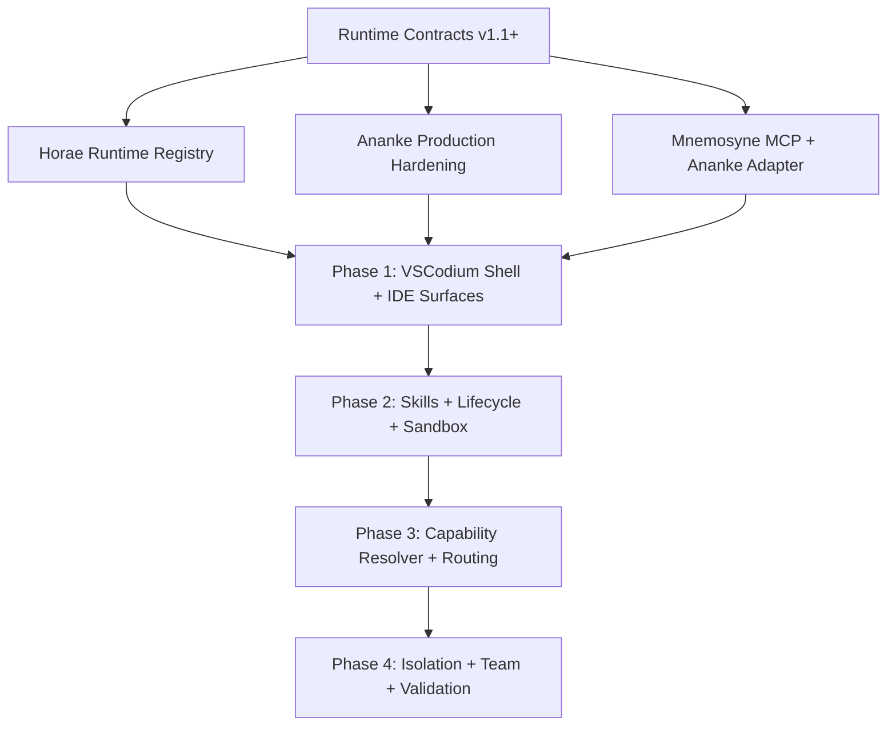

# Moirae Code — Roadmap & Build Plan

> **Status — July 2026:** Moirae monorepo scaffold complete and building (16 packages). **BLOCKED** waiting on completion of the Fate runtimes (Ananke, Mnemosyne, Horae) and Runtime Contracts extensions in their independent repositories. See [Blockers & Critical Path](#blockers--critical-path) below.

---

## Current State: What's Done vs What's Blocked

### Moirae Monorepo (This Repo) — DONE

| Package                              | State          | Description                                               |
| ------------------------------------ | -------------- | --------------------------------------------------------- |
| `@moirae/runtime-contracts`          | ✅ Built       | Shared types: identity, runtime, results, audit, protocol |
| `@moirae/local-ipc`                  | ✅ Built       | JSON-RPC 2.0 transport types                              |
| `@moirae/provider-sdk`               | ✅ Built       | ModelProvider interface + streaming events                |
| `@moirae/tool-sdk`                   | ✅ Built       | ToolManifest, RiskClass, SideEffectClass, ToolEvidence    |
| `@moirae/policy-profiles`            | ✅ Built       | Standard + Strict profiles with risk defaults             |
| `@moirae/secret-broker`              | ✅ Built       | OS keychain abstraction + in-memory impl                  |
| `@moirae/network-broker`             | ✅ Built       | 5-level outbound connection policy                        |
| `@moirae/supervisor`                 | ✅ Built       | Process lifecycle scaffold                                |
| `@moirae/ui-components`              | 🔶 Placeholder | React components — Phase 2                                |
| `@moirae/update-service`             | 🔶 Placeholder | Auto-updater — Phase 3                                    |
| `@moirae/core-extension`             | ✅ Built       | VS Code extension scaffold (4 sidebar views)              |
| `@moirae/diagnostics-cli`            | ✅ Built       | Working CLI (check, status, env)                          |
| `@moirae/ananke-client`              | ✅ Built       | Typed HTTP client for Ananke Gateway                      |
| `@moirae/mnemosyne-client`           | ✅ Built       | Typed MCP client for Almanac tools                        |
| `@moirae/horae-client`               | ✅ Built       | Typed HTTP client for Horae sessions                      |
| `@moirae/provider-openai-compatible` | ✅ Built       | Full adapter (Ollama, llama.cpp, LM Studio, vLLM, etc.)   |
| `@moirae/git-adapter`                | 🔶 Placeholder | Git operations — Phase 1                                  |

### External Dependencies — BLOCKED

| Repository                    | What We Need                                                                                                                        | Current State                                                           | Blocker Impact                                                   |
| ----------------------------- | ----------------------------------------------------------------------------------------------------------------------------------- | ----------------------------------------------------------------------- | ---------------------------------------------------------------- |
| **Project-Ananke**            | Production auth, Agent SDK, real MCP validation, content-sensitive reads, information-flow control                                  | ✅ Phase 1 prototype (60 tests, 7 scenarios) ❌ Not production-hardened | Cannot integrate governed execution into headless loop           |
| **Project-Mnemosyne**         | Complete MCP server (Almanac tools), Ananke safety bridge, validation reports, combined demo                                        | 🔄 MCP + Ananke adapter in progress (milestones 8-9)                    | Cannot retrieve governed context packs or route safety signals   |
| **Project-Horae**             | Runtime registry, capability planner, session orchestrator, profile loader, bindings to Ananke + Mnemosyne                          | ❌ Design docs only, zero implementation                                | No composition layer exists — this is the single biggest blocker |
| **project-runtime-contracts** | Workflow types, model descriptor types, context pack types, tool proposal types, approval types, evidence types, cancellation types | ✅ v1.1.0 base contracts ❌ Missing workflow/memory/approval types      | Shared types incomplete for cross-runtime orchestration          |

---

## Table of Contents

1. [Ecosystem Status Summary](#ecosystem-status-summary)
2. [Phase Roadmap](#phase-roadmap)
3. [Blockers & Critical Path](#blockers--critical-path)
4. [Third-Party Dependencies](#third-party-dependencies)
5. [Testing Strategy](#testing-strategy)
6. [Risk Register](#risk-register)

---

## Ecosystem Status Summary

### Current State of Component Runtimes

| Runtime               | Current Version            | Protocol Version    | Tests                                | Maturity                                           |
| --------------------- | -------------------------- | ------------------- | ------------------------------------ | -------------------------------------------------- |
| **Ananke**            | v0.1.0 (Phase 1 prototype) | v1.0.0              | 60 tests, 7 must-pass scenarios      | Solid prototype, not production-hardened           |
| **Mnemosyne**         | v0.1.0 (MVP)               | v1.0.0              | Unit tests across 8 packages         | MVP implemented, MCP + Ananke adapters in progress |
| **Horae**             | Pre-implementation         | Planned v1.1.0      | None yet                             | Design docs + scaffold only                        |
| **Runtime Contracts** | v1.1.0                     | v1.1.0 (min v1.0.0) | Sample import + protocol negotiation | Stable contracts, Horae-ready                      |

### What Each Runtime Currently Delivers

**Ananke (ready for integration):**

- Typed outcome envelopes with 7 states and 13 reason codes
- SHA-256 hash-bound approval binding over canonical JSON
- Deterministic risk-class-based policy engine (READ_ONLY, INTERNAL_WRITE, EXTERNAL_SEND, DELETE, PAYMENT, DEPLOYMENT, PERMISSION_CHANGE, UNKNOWN)
- SQLite + in-memory audit logging with pluggable `IAuditLog`
- MCP stdio client adapter (filesystem demo working)
- HTTP API on port 3000 with approval dashboard
- Policy file auto-discovery (ananke.policy.yaml/yml/json)
- Validation report export (JSON + CSV)
- 7 must-pass test scenarios: safe read allowed, policy denied, external send requires approval, approval hash match/mismatch, timeout typed outcome, prompt injection flagged

**Mnemosyne (ready for integration):**

- Almanac store (in-memory + SQLite-backed) with full CRUD
- Workspace guard (canonical path checks, symlink escape, traversal denial, delete policy)
- Onboarding engine (project scan, source hashing, source typing, candidate memory extraction)
- Reliability engine (source-type weights, hash validity, confirmations, contradictions, supersession)
- Retrieval engine (task-aware context-pack ranking, conflict propagation, token budgeting)
- Conflict engine (hash change detection, missing source, user-vs-law, supersession, recommendations)
- Decay engine (slow and fast decay, stale status transitions, revalidation recovery)
- Session engine (start revalidation, context pack creation, end summary, journal/audit updates)
- MCP adapter (9 Almanac tools: status, search, context_pack, read_memory, request_source, write_memory, append_journal, report_conflict, revalidate)
- Ananke adapter (safety bridge: CONFLICT_DETECTED, LOW_RELIABILITY_CONTEXT, SOURCE_MISSING, ACTION_CONTEXT_INSUFFICIENT)
- CLI scaffold (init, status)

**Horae (design phase):**

- Role and authority boundaries fully documented
- 12 Laws of Horae defined
- Architecture and runtime integration docs complete
- Implementation plan defined across 5 phases
- Package scaffold: schema, runtime-registry, capability-planner, session-orchestrator, profile-loader, ananke-binding, mnemosyne-binding, gateway-adapter, audit-router, runtime-core, testbench

**Runtime Contracts (ready for all consumers):**

- Runtime identity (name, version, protocol version, capabilities, metadata)
- Project identity (id, name, rootPath)
- Capability manifests (16 categories, 3 exposure levels)
- Runtime health (6 states: healthy, busy, read_only, updating, unavailable, degraded)
- Runtime registration (identity, endpoints, transport, health)
- Runtime profiles (7 modes: autonomous, ci, personal_development, production, read_only, strict_enterprise, testing)
- Runtime sessions (project, agent, task, profile, runtime bindings)
- Runtime compositions (bindings with roles: approval, audit, execution_governor, gateway, memory, orchestrator, policy, tool_source)
- Runtime events (14 event types)
- Well-known runtime names: ananke, mnemosyne, horae, moira

---

## Phase Roadmap (Revised — July 2026)

> **Source:** `docs/MOIRAE_CODE_RESEARCH_AND_REQUIREMENTS.md` — Build Order

### Phase 1 — VSCodium Shell + Core IDE Surfaces

**Goal:** VSCodium shell with runtime registration, provider adapters, project identity, and governed IDE panels.

| #    | Task                                                                                                                                                                                                           | Depends On                                        | Priority    | Status         |
| ---- | -------------------------------------------------------------------------------------------------------------------------------------------------------------------------------------------------------------- | ------------------------------------------------- | ----------- | -------------- |
| 1.1  | VSCodium thin fork: branding, default settings, Open VSX                                                                                                                                                       | —                                                 | 🔴 Critical | ❌ Not started |
| 1.2  | Runtime registration: discover Ananke + Mnemosyne + Horae                                                                                                                                                      | Horae Phase 1 (external)                          | 🔴 Critical | ❌ Blocked     |
| 1.3  | Provider adapters: OpenAI, Anthropic, Google, DeepSeek, llama.cpp, Ollama                                                                                                                                      | Provider SDK                                      | 🔴 Critical | ✅ Done        |
| 1.4  | Project identity: workspace binding, root paths, multi-root                                                                                                                                                    | Runtime Contracts                                 | 🔴 Critical | 🔶 Partial     |
| 1.5  | Task panel: active task, status, planned actions, blockers, token/cost/privacy                                                                                                                                 | Core extension                                    | 🔴 Critical | ❌ Not started |
| 1.6  | Mnemosyne view: active memories, proposals, contradictions, source refs, accept/edit/reject/forget                                                                                                             | Mnemosyne MCP (external)                          | 🔴 Critical | ❌ Blocked     |
| 1.7  | Ananke approval panel: pending approvals, policy profile, denied ops, revocation                                                                                                                               | Ananke HTTP API (external)                        | 🔴 Critical | ❌ Blocked     |
| 1.8  | Content preflight inspector: source identity, trust class, detected type/size, structural facts, scanner status, risk flags, exposure level, truncation/redaction state, stale receipts, Mnemosyne eligibility | Ananke + Mnemosyne + Runtime Contracts (external) | Critical    | Blocked        |
| 1.9  | Runtime panel: component health, connected models, MCP servers, local/network state                                                                                                                            | Supervisor                                        | 🟡 High     | 🔶 Partial     |
| 1.10 | Model/provider selector: model per message, defaults, fallback chains, cost limits, locality                                                                                                                   | Provider SDK                                      | 🟡 High     | 🔶 Partial     |
| 1.11 | Chat surface: custom webview with governance status header                                                                                                                                                     | Core extension                                    | 🟡 High     | ❌ Not started |

### Phase 2 — Governed Skills + Task Lifecycle + Sandbox

**Goal:** Governed skill registry, full task lifecycle, Git checkpoints, execution evidence, sandbox execution.

| #    | Task                                                                                                                                 | Depends On                                           | Priority    | Status         |
| ---- | ------------------------------------------------------------------------------------------------------------------------------------ | ---------------------------------------------------- | ----------- | -------------- |
| 2.1  | Governed Skill Registry: import, inspect manifest, trust classification, revision pin, rollback, Reticle scanning                    | Tool SDK                                             | 🔴 Critical | ❌ Not started |
| 2.2  | Skill kinds: `guidance`, `workflow`, `executable` with per-kind trust rules                                                          | 2.1                                                  | 🔴 Critical | ❌ Not started |
| 2.3  | Task lifecycle: create → plan → approve → run → pause → resume → cancel → recover → hand off → close → archive                       | Horae (external)                                     | 🔴 Critical | ❌ Blocked     |
| 2.4  | Cancellation: stop new actions, signal workers, preserve partial results, clean temp resources, produce restart record               | 2.3, Ananke (external)                               | 🔴 Critical | ❌ Blocked     |
| 2.5  | Git checkpoints: branch, base commit, working tree, changed/staged/untracked, generated files, tests, conflicts                      | Git adapter                                          | 🔴 Critical | ❌ Not started |
| 2.6  | Execution evidence: typed results with input/output hashes, affected resources, metrics, timestamps                                  | Ananke outcome engine                                | 🔴 Critical | 🔶 Partial     |
| 2.7  | Sandbox adapter: host, restricted process, container, microVM, remote sandbox modes                                                  | Network broker                                       | 🟡 High     | ❌ Not started |
| 2.8  | Git governance: push, force-push, branch deletion, release creation governed by Ananke                                               | 2.5, Ananke                                          | 🟡 High     | ❌ Not started |
| 2.9  | Execution log: chronological audit stream per task                                                                                   | Ananke audit engine                                  | 🟡 High     | ❌ Not started |
| 2.10 | Evidence viewer: diff review, command output, test results, side-effect summary                                                      | UI components                                        | 🟡 High     | ❌ Not started |
| 2.11 | Approval UX for content preflight: progressive disclosure, exact scope binding, destination/purpose display, invalidation conditions | Ananke approval types + Runtime Contracts (external) | High        | Blocked        |

### Phase 3 — Capability Resolution + Routing + Handoff

**Goal:** Capability resolver, framework adapters, local/remote routing, skill performance history, handoff and export.

| #   | Task                                                                                                     | Depends On               | Priority    | Status         |
| --- | -------------------------------------------------------------------------------------------------------- | ------------------------ | ----------- | -------------- |
| 3.1 | Capability resolver: analyse task → resolve required capabilities → instantiate minimum workers          | Horae capability planner | 🔴 Critical | ❌ Blocked     |
| 3.2 | Capability-based workers: minimum context, minimum authority, lifetime, cancellation path, typed results | 3.1                      | 🔴 Critical | ❌ Blocked     |
| 3.3 | Local/remote routing: explicit provider selection, cost limits, data residency, fallback policy          | Provider SDK             | 🔴 Critical | ✅ Done        |
| 3.4 | Provider abstraction: local models, direct APIs, OpenAI-compatible, enterprise gateways                  | Provider SDK             | 🟡 High     | ✅ Done        |
| 3.5 | Framework adapters: language/framework-specific skill packs                                              | 2.2                      | 🟡 High     | ❌ Not started |
| 3.6 | Skill performance history: per-skill, per-project outcome tracking                                       | 2.1                      | 🟢 Medium   | ❌ Not started |
| 3.7 | Handoff/export: portable project compendium, encrypted Almanac export                                    | Mnemosyne                | 🟢 Medium   | ❌ Not started |
| 3.8 | Provider-switch notice: explicit UI notification when model/provider changes                             | 3.3                      | 🟡 High     | ❌ Not started |

### Phase 4 — Isolation + Team Mode + Public Validation

**Goal:** Advanced isolation, team/enterprise mode, signed skills, public validation harness, curated catalogue.

| #   | Task                                                                       | Depends On       | Priority    | Status         |
| --- | -------------------------------------------------------------------------- | ---------------- | ----------- | -------------- |
| 4.1 | Advanced isolation: container, microVM, remote sandbox enforcement         | 2.7              | 🔴 Critical | ❌ Not started |
| 4.2 | Team mode: shared policies, team Almanac, managed model gateways           | Phase 3          | 🟡 High     | ❌ Not started |
| 4.3 | Signed skills: cryptographic verification of skill manifests and integrity | 2.1              | 🟡 High     | ❌ Not started |
| 4.4 | Public validation harness: downloadable test suite for community testing   | Testbench        | 🟡 High     | ❌ Not started |
| 4.5 | Curated skill catalogue: governed, reviewed, classified skill marketplace  | 2.1, 4.3         | 🟢 Medium   | ❌ Not started |
| 4.6 | Enterprise MCP identity and authorization                                  | MCP spec         | 🟢 Medium   | ❌ Not started |
| 4.7 | Central extension governance: allow/deny, version pinning, quarantine      | Extension policy | 🟢 Medium   | ❌ Not started |
| 4.8 | Organisation identity: OIDC + SAML via identity broker                     | —                | 🟢 Medium   | ❌ Not started |

---

## Blockers & Critical Path

### Current Blockers (Updated July 2026)

| ID   | Blocker                                                      | Impact                                                          | Affected Phases | Mitigation / Status                                                                                                                                                                                         |
| ---- | ------------------------------------------------------------ | --------------------------------------------------------------- | --------------- | ----------------------------------------------------------------------------------------------------------------------------------------------------------------------------------------------------------- |
| B-01 | **Horae not yet implemented**                                | Cannot start Phase 1 headless loop                              | 1, 2, 3, 4, 5   | ❌ External repo — [Project-Horae](https://github.com/hourwise/Project-Horae) has design docs only. This is the single biggest blocker.                                                                     |
| B-02 | **Mnemosyne MCP server incomplete**                          | Cannot expose governed memory to Horae/IDE                      | 1, 2            | 🔄 In progress — [Project-Mnemosyne](https://github.com/hourwise/Project-Mnemosyne) Milestone 8 of 9.                                                                                                       |
| B-03 | **Mnemosyne Ananke adapter incomplete**                      | Cannot route safety signals between memory and authority        | 1, 2            | 🔄 In progress — [Project-Mnemosyne](https://github.com/hourwise/Project-Mnemosyne) Milestone 9 of 9.                                                                                                       |
| B-04 | **Ananke needs production hardening**                        | Dashboard/API auth insufficient for real use; Agent SDK missing | 1, 2, 3         | ❌ External repo — [Project-Ananke](https://github.com/hourwise/Project-Ananke) roadmap: production auth, real MCP validation, Agent SDK.                                                                   |
| B-05 | **Runtime Contracts missing workflow/memory/approval types** | Horae cannot describe governed task compositions                | 0, 1            | ❌ External repo — [project-runtime-contracts](https://github.com/hourwise/project-runtime-contracts) needs workflow, model, context, tool proposal, approval, memory, audit, evidence, cancellation types. |

### Resolved Blockers (Moirae Monorepo)

| ID                    | Former Blocker                       | Resolution                                                                                                           |
| --------------------- | ------------------------------------ | -------------------------------------------------------------------------------------------------------------------- |
| ~~B-02~~              | No Provider SDK                      | ✅ `@moirae/provider-sdk` built with full ModelProvider interface + streaming events                                 |
| ~~B-06~~              | No shared IPC protocol               | ✅ `@moirae/local-ipc` built with JSON-RPC 2.0 message types + transport interface                                   |
| ~~Provider adapters~~ | No model adapters                    | ✅ 5 adapters built: OpenAI-compatible, Anthropic (Claude), Google (Gemini), DeepSeek, llama.cpp                     |
| ~~Tool SDK~~          | No tool manifest types               | ✅ `@moirae/tool-sdk` built with Zod-validated manifests, 8 risk classes, 8 side-effect classes, ManifestValidator   |
| ~~Policy profiles~~   | No default policy configs            | ✅ `@moirae/policy-profiles` built with Standard + Strict profiles                                                   |
| ~~Secret handling~~   | No credential abstraction            | ✅ `@moirae/secret-broker` built with InMemorySecretBroker                                                           |
| ~~Network control~~   | No outbound policy                   | ✅ `@moirae/network-broker` built with 5-level NetworkMode                                                           |
| ~~Supervisor~~        | No process lifecycle                 | ✅ `@moirae/supervisor` built with health checks, crash recovery, 7-state lifecycle                                  |
| ~~Moirae types~~      | No supervisor/packaging/update types | ✅ `@moirae/runtime-contracts/src/moirae/` with SupervisorConfig, PackagingManifest, UpdateManifest, ExtensionPolicy |
| ~~Tests~~             | No contract/adversarial tests        | ✅ 69 tests passing: 25 runtime-contracts + 16 validator + 10 supervisor + 18 adversarial                            |

### Next Tasks Once Unblocked (Priority Order)

When the external repos reach minimum viable state, the immediate work is:

| #   | Task                                             | Package                        | Depends On            |
| --- | ------------------------------------------------ | ------------------------------ | --------------------- |
| 1   | Implement Horae Runtime Registry                 | New: `packages/horae-runtime/` | B-01, B-05            |
| 2   | Implement Horae Capability Planner               | New: `packages/horae-runtime/` | Task 1                |
| 3   | Implement Horae Session Orchestrator             | New: `packages/horae-runtime/` | Tasks 1-2, B-02, B-03 |
| 4   | Wire Supervisor to spawn & manage Fate processes | `packages/supervisor/`         | Tasks 1-3, B-01, B-04 |
| 5   | End-to-end governed vertical slice (CLI demo)    | `apps/diagnostics-cli/`        | Tasks 1-4             |
| 6   | Export combined JSON/CSV validation reports      | `scripts/`                     | Task 5                |

### What Can Be Done Now (Unblocked Work — Updated July 2026)

While waiting on the external repos, the Moirae monorepo has completed:

- ✅ `@moirae/provider-sdk` — 5 provider adapters: OpenAI-compatible, Anthropic, Google, DeepSeek, llama.cpp
- ✅ `@moirae/tool-sdk` — ManifestValidator with risk scoring, publisher trust, and integrity checks
- ✅ `@moirae/runtime-contracts` — Moirae-specific types: SupervisorConfig, PackagingManifest, UpdateManifest, ExtensionPolicy
- ✅ `@moirae/supervisor` — Health check polling, crash recovery with 3-tier escalation, 7-state component lifecycle
- ✅ 69 contract + adversarial tests passing across 4 suites

Still available to work on:

- **`@moirae/tool-sdk`** — Skill manifest types (`SkillKind`: `guidance`, `workflow`, `executable`), skill registry types
- **`@moirae/provider-sdk`** — Additional adapters (Mistral, Ollama native, LM Studio)
- **`@moirae/ui-components`** — Design task panel, memory panel, approvals panel, runtime panel, skill registry, execution log, evidence viewer React components
- **`tests/contract/`** — Provider adapter contract tests
- **`tests/adversarial/`** — Skill injection, worker escape, sandbox bypass scenarios
- **`packages/skill-registry/`** — New package: skill import, manifest inspection, trust classification, Reticle scanning scaffold
- **Docs** — Threat model, skill author guide, provider integration guide

### Critical Path (Revised for Research Build Order)

```
Phase 1 Dependencies (external):
  Horae Runtime Registry → Runtime Contracts workflow types → Ananke production auth
                              ↓
Phase 1: VSCodium Shell + Core IDE Surfaces ← FIRST MILESTONE
    ↓
Phase 2: Governed Skills + Task Lifecycle + Sandbox
    ↓
Phase 3: Capability Resolver + Routing + Handoff
    ↓
Phase 4: Advanced Isolation + Team Mode + Public Validation
```

### Dependency Graph (Revised)



---

## Third-Party Dependencies

### Build & Runtime Foundations

| Dependency                            | Version                 | License       | Usage                                                                | Risk Level                                        |
| ------------------------------------- | ----------------------- | ------------- | -------------------------------------------------------------------- | ------------------------------------------------- |
| **VSCodium / Code-OSS**               | Latest stable           | MIT           | Editor foundation, extension host, terminal, Git UI, debugger        | 🟢 Low — thin fork, minimal patches               |
| **Electron**                          | Inherited from VSCodium | MIT           | Cross-platform desktop shell                                         | 🟢 Low — inherited, must verify security settings |
| **Node.js**                           | 22+ LTS                 | MIT           | Local control plane, supervisor, all Fates                           | 🟢 Low                                            |
| **TypeScript**                        | 5.x                     | Apache 2.0    | All first-party packages                                             | 🟢 Low                                            |
| **SQLite** (better-sqlite3 or native) | 3.x                     | Public Domain | Persistent state for Ananke audit, Mnemosyne Almanac, Horae registry | 🟢 Low — WAL mode required                        |

### Extension Ecosystem

| Dependency                | License                    | Usage                                                            | Risk Level                              |
| ------------------------- | -------------------------- | ---------------------------------------------------------------- | --------------------------------------- |
| **Open VSX**              | Eclipse Public License 2.0 | Extension marketplace (instead of Microsoft Marketplace)         | 🟢 Low — can self-host curated registry |
| **VS Code Extension API** | MIT                        | Extension development (views, webviews, chat, secrets, terminal) | 🟢 Low — official API                   |

### Model Provider APIs (to be adapted)

| Provider                        | Locality     | Authentication        | Risk Level                               |
| ------------------------------- | ------------ | --------------------- | ---------------------------------------- |
| **Ollama**                      | Local        | None (loopback)       | 🟢 Low                                   |
| **llama.cpp**                   | Local        | None (loopback)       | 🟢 Low                                   |
| **LM Studio**                   | Local        | None (loopback)       | 🟢 Low                                   |
| **OpenAI-compatible** (generic) | Local/Remote | API key → OS keychain | 🟡 Medium — credential handling critical |
| **Anthropic**                   | Remote       | API key → OS keychain | 🟡 Medium                                |
| **Google Gemini**               | Remote       | API key → OS keychain | 🟡 Medium                                |
| **DeepSeek**                    | Remote       | API key → OS keychain | 🟡 Medium                                |
| **Mistral**                     | Remote       | API key → OS keychain | 🟡 Medium                                |

### MCP Infrastructure

| Dependency                                     | Usage                                | Risk Level                                    |
| ---------------------------------------------- | ------------------------------------ | --------------------------------------------- |
| **MCP Specification** (Model Context Protocol) | Tool/server communication protocol   | 🟡 Medium — evolving spec, must track changes |
| **MCP SDK** (@modelcontextprotocol/sdk)        | Stdio/HTTP transport for MCP servers | 🟡 Medium                                     |

### Security & Packaging

| Dependency                           | Usage                         | Risk Level                     |
| ------------------------------------ | ----------------------------- | ------------------------------ |
| **Windows Credential Manager**       | API key storage on Windows    | 🟢 Low — OS-native             |
| **macOS Keychain**                   | API key storage on macOS      | 🟢 Low — OS-native             |
| **Linux Secret Service / libsecret** | API key storage on Linux      | 🟢 Low — OS-native             |
| **Git Credential Manager**           | Git authentication            | 🟢 Low — existing, well-tested |
| **OpenID Connect / SAML**            | Enterprise identity (Phase 5) | 🟢 Low — standard protocols    |

### Development & Testing

| Dependency     | Usage                                                | Risk Level |
| -------------- | ---------------------------------------------------- | ---------- |
| **Vitest**     | Testing framework (used by Ananke, Mnemosyne, Horae) | 🟢 Low     |
| **Zod**        | Schema validation (used by all projects)             | 🟢 Low     |
| **Playwright** | E2E testing (planned)                                | 🟢 Low     |

### Evaluation-Only (Inspiration, Not Direct Dependency)

These are studied for architectural patterns but must NOT be adopted as dependencies:

| Project             | Studied For                                                              | Why Not a Dependency                                 |
| ------------------- | ------------------------------------------------------------------------ | ---------------------------------------------------- |
| **Continue**        | Provider abstraction, prompt streaming, context providers, diff handling | Authority layer must remain Moirae's                 |
| **Cline/Roo**       | Step-based tool presentation, file-diff approval, terminal output        | Broad implicit authority; model-owned approval logic |
| **OpenHands/Aider** | Git checkpointing, patch application, repository maps                    | Must be behind Ananke + Horae boundaries             |
| **GitHub Copilot**  | N/A                                                                      | Proprietary; Moirae must function without it         |

---

## Testing Strategy

Moirae inherits and expands the validation system from its component runtimes.

### Test Levels

| Level           | Purpose                                                               | Target Duration   |
| --------------- | --------------------------------------------------------------------- | ----------------- |
| **Environment** | Node, npm, SQLite, ports, dependencies, component versions            | < 10 seconds      |
| **Quick**       | Build, unit tests, core scenario benchmark, demo, reports             | < 5 minutes       |
| **Standard**    | Full unit + integration tests across all components                   | 3-5 minutes       |
| **Full**        | All bundled tests, demos, persistence restart, session lifecycle      | 10-15 minutes     |
| **Hostile**     | Malicious, malformed, interrupted, concurrency, and adversarial cases | Project-dependent |

### Required Test Families

#### Normal Operation

- Chat with local and hosted models
- Code edits with diff approval
- Command execution with sandbox
- Test running and results
- Git operations (commit, branch, push, PR)
- Session resume and state recovery
- Memory retrieval and context construction

#### Boundary Tests

- Path traversal and symlink escape attempts
- Cross-workspace memory leakage
- Stale approval reuse
- Source mutation invalidates content preflight receipts and access
- Mutated diff after approval
- Wrong branch / changed remote / changed tool version
- Expired credential handling

#### Malicious Tests

- README/issue/comment prompt injection
- Detector-bait content that attempts to coerce full-content exposure
- Poisoned MCP tool descriptions
- Malicious extension installation attempts
- MCP cross-server exfiltration
- Secret harvesting from context
- Invisible Unicode instructions
- Terminal escape sequence injection
- Forged tool outcomes
- Audit log tampering
- Memory poisoning (false memories, poisoned sources)

#### Reliability Tests

- Model crash during operation
- Local server disappearance (Ollama/llama.cpp)
- Network interruption during hosted call
- Partial file write recovery
- Extension host restart
- SQLite lock contention
- Incompatible component version
- Interrupted database migration

#### Coexistence Tests

- Ananke + Mnemosyne operating simultaneously
- Multiple MCP servers active
- Multiple provider adapters registered
- Remote workspaces (SSH, containers, WSL)
- Large monorepositories
- Windows, Linux, and macOS

### Validation Report Shape

Every test result captures:

- Moirae build version + commit SHA
- OS, OS build, CPU architecture
- VSCodium upstream version
- Installed extensions
- Ananke / Mnemosyne / Horae versions
- Model identity and quantization
- Provider adapter
- Harness/editor/client context
- Workspace type
- Active policy profile
- Expected vs actual outcome
- Duration
- Logs and evidence pointers
- Reproduction command

---

## Risk Register

| ID   | Risk                                                          | Likelihood | Impact   | Mitigation                                                                                                              |
| ---- | ------------------------------------------------------------- | ---------- | -------- | ----------------------------------------------------------------------------------------------------------------------- |
| R-01 | VSCodium upstream introduces breaking changes                 | Medium     | High     | Thin fork only; minimize patches; track upstream releases                                                               |
| R-02 | MCP specification evolves incompatibly                        | Medium     | Medium   | Abstract MCP behind adapters; version-pin server manifests                                                              |
| R-03 | Model provider APIs change or deprecate                       | High       | Medium   | Generic OpenAI-compatible adapter as universal fallback; provider-specific adapters are thin wrappers                   |
| R-04 | Performance overhead of per-call governance                   | Medium     | Medium   | Safe reads pass through with minimal latency; benchmark and optimize hot paths                                          |
| R-05 | User resistance to approval UX friction                       | Medium     | High     | Tiered risk classes; policy profiles; approval memory (approve workflow, not each call)                                 |
| R-06 | Electron security vulnerabilities                             | Medium     | High     | Track Electron security advisories; implement all recommended security settings; renderer sandboxing; context isolation |
| R-07 | Extension supply chain attacks                                | Medium     | High     | Curated registry; signed extensions; hash verification; quarantine mode; permission transparency                        |
| R-08 | SQLite corruption or lock contention                          | Low        | Medium   | WAL mode; separate DB files per runtime; backup/restore tooling                                                         |
| R-09 | Secret leakage through model context or logs                  | Medium     | Critical | Pre-flight secret scanning; redaction; OS keychain only; never in settings.json or SQLite                               |
| R-10 | Prompt injection bypassing Ananke policy                      | Medium     | Critical | Separate instructions from content; tag provenance; external content cannot override policy; canary detection           |
| R-11 | Content preflight states confuse users or overstate certainty | Medium     | High     | Progressive disclosure, plain-language exposure labels, stale-state visibility, and no colour-only status communication |
